### Hi there 👋

👋 Hello, I'm Kim Y.D

🚀 Engineer & Product Owner

  

📋 About Me

📫 How to reach me: centurio87@naver.com

🛠 Tech Stack

💻 Programming Languages

🚀 Frameworks & Tools

🗄 Database & Cloud

📊 GitHub Stats

🔗 Connect with me

Last updated: 2026-03-09

