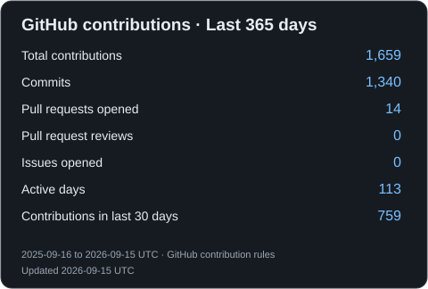
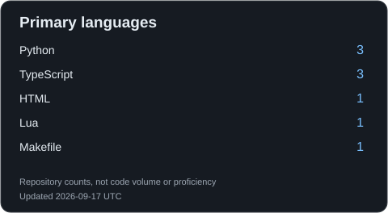

<!--
  centurio1987 프로필 README
  본문은 `~/.claude/skills/profile-update` 스킬이 마커 영역만 자동 갱신합니다.
  마커 밖(인사말, Connect, GitHub Stats 등)은 사람이 직접 편집합니다.
-->

### 👋 안녕하세요, 김윤덕입니다

<!-- profile:headline:start -->
**Product Owner · Node.js Engineer · CTO · Product Engineer** — 경력 6년 3개월
<!-- profile:headline:end -->

<!-- profile:intro:start -->
자원이 부족하고 방향이 자주 바뀌는 스타트업에서 **0→1 제품과 팀의 개발 시스템을 함께 설계**해 왔습니다.
PO로 전략·제품을 그리고, CTO로 의사결정의 기술 정합성을 책임지며,
**NestJS로 도메인을 직접 손코딩하는 Product Engineer**입니다.
LCA(전과정평가) SaaS와 DX 솔루션을 0→1로 만들고, 온프레미스 네이티브 Kubernetes 위에 제품팀 시스템을 정착시켰습니다.
한 사람이 **기획에서 구현까지 all-in-one**으로 책임지는 흐름을 좋아합니다.
<!-- profile:intro:end -->

<!-- profile:bullets:start -->
- 🔭 현재 관심사: Plugin 아키텍처 운영 · 온프레미스 네이티브 K8s · 제품팀 시스템
- 🌱 학습 중: Rust (`estd` 실험), 개인 지식 베이스(my-wiki)
- 💼 **PO · CTO · Product Engineer 역할을 한 흐름으로 풀 수 있는 자리를 찾고 있습니다 (Open to opportunities)**
- 📫 연락: centurio87@naver.com
<!-- profile:bullets:end -->

---

#### 🧩 무엇을 해왔나

<!-- profile:experience-summary:start -->
- **풀스택 (Node.js 중심)** — NestJS · GraphQL · TypeORM/Prisma · PostgreSQL 기반 도메인 모델링과 API 운영. DDD·레이어드/헥사고날과 Plugin 아키텍처로 0→1을 짠다.
- **프론트엔드 풀스택** — Vue/Nuxt·Next·TypeScript. Atomic Design 기반 컴포넌트 분리, Service Worker+IndexedDB 캐시 동기화.
- **인프라·DevOps** — On-Premise 네이티브 K8s(Talos OS·iPXE) · Terraform/Terramate IaC · Keycloak SSO/IAM · GitOps · 관측가능성 · ISO 27001·27017.
- **제품·PO** — 전략 분석(PESTEL·3C·5Forces·STP) · Contextual Inquiry 기반 제품 발견 · PMF 정렬 제품 정의·제품화 전략.
- **리더십·팀 시스템** — IT 거버넌스·개발 표준 수립, 팀원을 Product Engineer로 육성해 기획~엔지니어링을 한 사람이 책임지게 한다.
- **도메인** — LCA(전과정평가)·온실가스 DX·고가 시계 시세/거래·앱 푸시/메트릭 수집·On-Premise Cloud 솔루션.
<!-- profile:experience-summary:end -->

#### 🔬 사이드 프로젝트

<!-- profile:projects:start -->
> 2025년 이후 시작한 작업 위주로 정리했습니다. 공개 repo는 직접 들어가서 보실 수 있고,
> 비공개는 회사 자산이거나 포트폴리오용 샘플이라 이름과 요약만 표기합니다.

**공개**

| 프로젝트 | 설명 |
|---|---|
| [my-claude-plugins](https://github.com/centurio1987/my-claude-plugins) | 개인 Claude 플러그인 마켓플레이스 — 워크플로우 자동화 실험 |
| [my-wiki](https://github.com/centurio1987/my-wiki) | 개인 지식 베이스 위키 |
| [design-pattern-guide](https://github.com/centurio1987/design-pattern-guide) | 디자인 패턴 학습·정리 노트 |
| [my-nvim](https://github.com/centurio1987/my-nvim) | 개인 Neovim 설정 |

**비공개 (요약만)**

- `stock-analysis` — 주식 투자 인사이트 보고 자동 생성
- `tr-docs` — 공식 문서·PDF를 EPUB으로 재구성하는 도구 (Python)
- `mindful-fortune-teller` — 20~30대 여성 타겟 운세 앱 (TypeScript)
- `estd` — Rust 학습/실험
- `carbon-accounting-nest-sample` · `carbon-accounting-vue-sample` · `lync-sample` — LCA·탄소회계 도메인 포트폴리오 샘플 (NestJS·Vue·LynC)
- `infrastructure` — 개인 인프라 IaC (HCL)
- `obsidian-writing-vault` — 개인 글쓰기 vault
<!-- profile:projects:end -->

---

#### 🛠 기술 스택

**주력**

<!-- profile:tech-primary:start -->

<!-- profile:tech-primary:end -->

**사용 경험**

<!-- profile:tech-secondary:start -->

<!-- profile:tech-secondary:end -->

---

#### 🔗 Connect

---

📊 GitHub Stats

 

<!-- profile:last-updated:start -->
<!-- Last updated: 2026-06-02 -->
<!-- profile:last-updated:end -->
