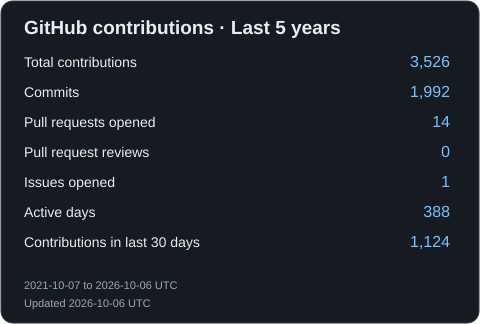
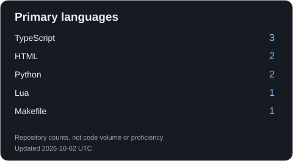
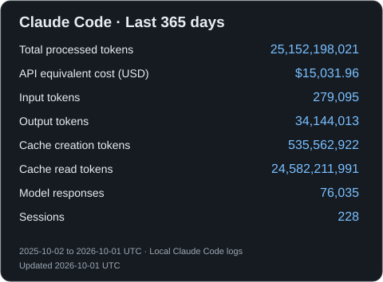
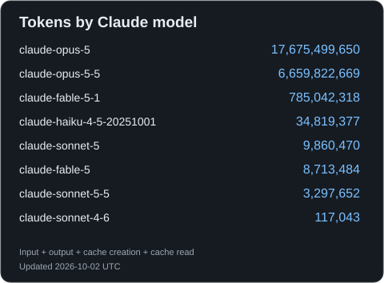
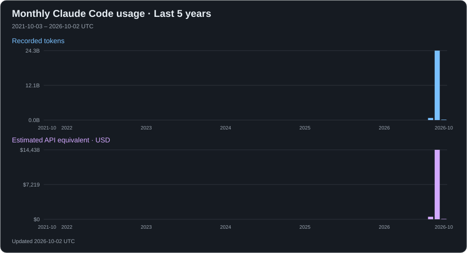

# 김윤덕

<!-- profile:headline:start -->
**제품의 문제를 정의하고, 도메인 설계부터 구현·운영까지 연결하는 엔지니어입니다.**

Product Engineer · Node.js / TypeScript · CTO / PO 경험
<!-- profile:headline:end -->

<!-- profile:intro:start -->
고객의 업무를 이해하는 일에서 개발을 시작합니다. 무엇을 만들지 결정하는 제품 전략과, 그것을 실제로 동작하게 만드는 기술 설계가 한 흐름으로 이어져야 한다고 생각합니다.

스타트업에서 B2B SaaS와 디지털 전환 솔루션을 처음부터 만들며 백엔드·화면·인프라를 함께 책임졌습니다. NestJS와 TypeScript로 도메인 경계를 설계하고, Vue/Nuxt와 Next.js로 사용자에게 닿는 기능을 구현했습니다. CTO와 PO로 일하며 기술 표준과 개발 프로세스를 세우고, 현장 관찰과 인터뷰를 바탕으로 제품의 방향을 조정해 왔습니다.

좋은 코드는 사람이 읽기 쉽고 의도가 분명한 코드라고 믿습니다. 이름과 책임을 명확하게 나누고, 성능은 측정한 뒤 개선하며, 다음 사람이 판단의 근거를 따라갈 수 있도록 기록합니다.
<!-- profile:intro:end -->

## 경험과 일하는 방식

<!-- profile:experience-summary:start -->
| 영역 | 해온 일 | 설계에서 중요하게 보는 것 |
| --- | --- | --- |
| 도메인·백엔드 | NestJS 기반 API, 도메인 모델링, CQRS 읽기·쓰기 분리, Plugin 아키텍처 | 비즈니스 규칙과 데이터 접근의 책임을 나누고, 확장이 코어 변경으로 번지지 않게 합니다. |
| 풀스택·성능 | 화면 컴포넌트 설계, 엑셀 데이터 변환, Service Worker·IndexedDB 동기화 | 사용자의 기존 업무를 이해하고, 전송 데이터와 중복 요청부터 줄입니다. |
| 인프라·운영 | 온프레미스 Kubernetes, 코드형 인프라, GitOps, 인증·관측 환경 구축 | 비용·운영 인력·장애 원인 추적을 함께 고려합니다. |
| 제품·팀 | 현장 맥락 조사, 제품 전략·가격 정책, 개발 표준·팀 프로세스 수립 | 사용자와 구매자의 문제를 구분하고, 팀이 기획부터 구현까지 책임질 환경을 만듭니다. |
<!-- profile:experience-summary:end -->

## 개인 프로젝트

<!-- profile:projects:start -->
현재 개인 작업은 **재사용 가능한 UI**, **AI를 활용한 업무 관리와 자동화**, **학습과 지식의 축적**을 중심으로 이어지고 있습니다. tomae에서는 에이전트의 계획·실행·검토를 연결하고, 번역 도구와 리서치 위키에서는 자료를 재사용 가능한 지식으로 쌓고 있습니다.

### 개발 도구와 자동화

| 프로젝트 | Summary | 구현·탐구 내용 | 최근 반영 |
| --- | --- | --- | --- |
| [bbangto-ui](https://github.com/centurio1987/bbangto-ui) | 화면과 시각화를 일관된 규칙으로 조립하는 React 디자인 시스템 | 디자인 토큰, 컴포넌트·블록·패턴, 스타일 가이드 카탈로그, headless 시각화와 Storybook 검증 환경 | 2026-08-25 |
| [my-claude-plugins](https://github.com/centurio1987/my-claude-plugins) | 반복 작업을 재사용 가능한 플러그인으로 묶는 개인 마켓플레이스 | 집필 규칙을 공유하는 authoring-kit과 문체 검사 도구, 웹 리서치·위키 관리·애니메이션·프로젝트 초기화 플러그인 | 2026-10-01 |
| [tech-news-wiki](https://github.com/centurio1987/tech-news-wiki) | 기술 뉴스를 수집·검토해 누적형 지식으로 만드는 파이프라인 | Python 기반 수집·중복 제거·클러스터링, 신뢰도 검토, 위키 생성과 지식그래프 점검 | 2026-07-02 |
| tr-docs (비공개) | PDF와 공식 문서를 한국어 EPUB으로 만드는 번역 도구 | 청크별 진행 상태 저장과 중단 후 재개, OCR 대체 처리, 병렬 번역과 EPUB 생성 | 2026-06-02 |

### 제품 실험과 기록

| 프로젝트 | Summary | 구현·탐구 내용 | 최근 반영 |
| --- | --- | --- | --- |
| tomae (비공개) | AI 에이전트의 계획·실행·검토를 연결하는 프로젝트 관리 앱 | Electron 기반 다중 프로젝트 운영, 칸반·Git·PR 연동, 워크플로 편집기와 전략 맵 | 2026-09-28 |
| bbangto-secretary (비공개) | 업무 기록과 할 일을 연결하는 AI 업무 보조 서비스 기획 | 활동 기록·대시보드·할 일 그래프·대화 경험의 요구사항 정리, 시스템 설계 전략 구상 | 2026-09-15 |
| [mindful-fortune-teller](https://github.com/centurio1987/mindful-fortune-teller) | 운세와 대화를 접점으로 삼은 마음챙김 웹 앱 실험 | Vue 3·Bun·SQLite 기반 풀스택 구성, 감정 기록과 AI 파트너 대화 | 2026-05-10 |
| [centurio1987.github.io](https://github.com/centurio1987/centurio1987.github.io) | 기술 해설과 개인 글을 쌓는 Astro 블로그 | MDX 콘텐츠, 리서치·초고·검토로 이어지는 집필 과정, GitHub Pages 배포 | 2026-09-10 |

### 학습과 지식 관리

| 프로젝트 | Summary | 구현·탐구 내용 | 최근 반영 |
| --- | --- | --- | --- |
| [grow-up-programming](https://github.com/centurio1987/grow-up-programming) | 문제·풀이·테스트·해설을 함께 축적하는 알고리즘 학습 저장소 | TypeScript·Bun 테스트와 React 시뮬레이션, 실습을 포함한 Markdown 가이드, 풀이·분석을 solutions 브랜치에 보존하는 병합 도구 | 2026-10-01 |
| [grow-up-architecture](https://github.com/centurio1987/grow-up-architecture) | 디자인 패턴과 객체 모델링을 비교 학습하는 노트 | Python·TypeScript·Rust·Java 패턴 실습, Transaction·Account·Entry 객체 모델링 해설 | 2026-06-12 |
| [my-wiki](https://github.com/centurio1987/my-wiki) | 개인 지식과 참고 자료를 축적하는 위키 | 지식 관리와 학습 기록 | 2026-06-10 |
| blog-research (비공개) | 수집한 자료에서 블로그 글감을 발전시키는 리서치 위키 | 원본 자료 요약·상호 연결, 주제별 근거 축적, 집필 관점과 부족한 자료 정리 | 2026-08-18 |
| stock-analysis (비공개) | 기업·산업·투자 주제를 누적 분석하는 개인 지식 베이스 | 기사·리포트·공시 기반 요약, 기업·섹터 교차 참조, 출처와 모순 점검 | 2026-07-09 |
| estd (비공개) | 범용 자료구조와 알고리즘을 구현하는 Rust 라이브러리 | 힙 기반 우선순위 큐, 방향·가중치 그래프, BFS·DFS·Dijkstra와 사이클 탐지 | 2026-05-29 |

<!-- profile:projects:end -->

## 기술 스택

<!-- profile:tech-primary:start -->
**주력** — TypeScript · Node.js · NestJS · Vue / Nuxt · PostgreSQL

도메인 모델링과 API 구현에서 시작해 화면과 데이터 흐름까지 연결합니다.
<!-- profile:tech-primary:end -->

<!-- profile:tech-secondary:start -->
| 영역 | 사용 경험 |
| --- | --- |
| 프론트엔드 | Next.js · Atomic Design · Service Worker · IndexedDB |
| API·데이터 | GraphQL / Apollo · TypeORM · Prisma |
| 인프라·배포 | Kubernetes · Talos OS · Terraform · Terramate · AWS · GitHub Actions |
| 인증·관측 | Keycloak · Prometheus · Grafana · Elasticsearch |
| 테스트·개발 환경 | Jest · Vitest · Storybook · Nx Monorepo |
<!-- profile:tech-secondary:end -->

## 연락처

<!-- profile:contact:start -->
- **Email** — [centurio87@naver.com](mailto:centurio87@naver.com)
- **LinkedIn** — [김윤덕](https://www.linkedin.com/in/yoondeok-kim-319bb8145)
- **Blog** — [빵관 토니](https://centurio1987.github.io)
<!-- profile:contact:end -->

## GitHub 활동

<!-- profile:stats:start -->

### Claude Code 사용량

<!-- profile:stats:end -->
